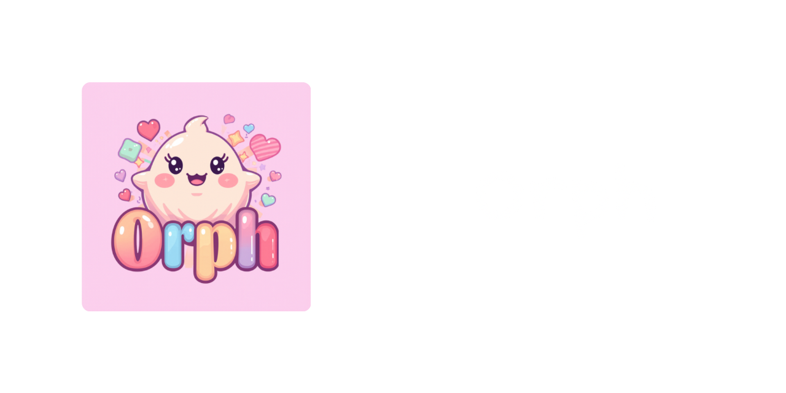

# Orph




[](https://github.com/CoreRed-Project/orph-cli/actions)

<p align="center">
  <strong>Lightweight ✦ Ergonomic ✦ Offline-first</strong><br>
  <em>A cyberdeck-oriented CLI companion for your local machine.</em>
</p>

<p align="center">
  <a href="#about">About</a> ✦
  <a href="#features">Features</a> ✦
  <a href="#installation">Installation</a> ✦
  <a href="#usage">Usage</a> ✦
  <a href="#contributing">Contributing</a>
</p>

---

## About

**Orph** is a lightweight, offline-first CLI tool for local system management, script execution, and personal workflow automation — built for cyberdeck-oriented setups.

It ships as two binaries: `orph` (the CLI) and `orphd` (an optional background daemon). The CLI works standalone; the daemon adds persistent state management over a Unix socket. No network calls. No cloud. Everything lives in `~/.orph/`.

### Philosophy

> *"Local-first. No external services. No dependencies beyond the binary."*

Orph is built for people who want their tools fast, predictable, and entirely under their control. The daemon is optional — if it's not running, the CLI falls back to local execution transparently. No noise.

This is a **Core Red** project, part of the Sxnnyside Project's experimental branch.

## Features

- **System monitoring**: CPU, memory, disk usage and host info via `orph sys`
- **Script runner**: Execute scripts from `~/.orph/scripts/` with timeout, captured output, and path safety
- **Virtual pet** ฅ^•ﻌ•^ฅ: A time-decaying companion that lives in your terminal — `orph pet`
- **Config store**: SQLite-backed key/value config via `orph cfg`
- **Local telemetry**: Command usage tracking, stored locally, never transmitted
- **Shell completions**: Bash, Zsh, Fish via `orph completions`
- **Optional daemon (`orphd`)**: Background Unix socket server for persistent state; CLI falls back gracefully if offline

## Installation

### Prerequisites

- [Rust](https://rustup.rs/) (1.85+)

### From Source

```bash
git clone https://github.com/CoreRed-Project/orph-cli.git
cd orph-cli

# Build and install both binaries
make build
make install
```

Both `orph` and `orphd` need to be on `$PATH` for `orph core start` to work. `make install` handles that.

### Cross-compilation (Raspberry Pi 5)

```bash
make cross
# copy target/aarch64-unknown-linux-gnu/release/{orph,orphd} to your Pi
```

## Usage

```bash
# system
orph sys status
orph sys info

# scripts — stored in ~/.orph/scripts/
# first run of `orph run list` creates the directory and a sample script
orph run list
orph run my-script --timeout 30

# add your own script:
#   echo '#!/bin/sh' > ~/.orph/scripts/hello
#   echo 'echo "hello!"' >> ~/.orph/scripts/hello
#   chmod +x ~/.orph/scripts/hello
#   orph run hello

# pet (no subcommand defaults to status)
orph pet
orph pet feed
orph pet play
orph pet rename HAL

# config
orph cfg list
orph cfg get <key>
orph cfg set <key> <value>

# logs
orph logs                   # view all
orph logs -n 20             # last 20 lines
orph logs -f                # follow (like tail -f)
orph logs --level warn

# daemon lifecycle (optional — CLI works without it)
orph core start             # start orphd in background
orph core status            # check if running
orph core stop

# telemetry
orph telemetry
orph telemetry top

# shell completions (add to your shell profile)
orph completions zsh >> ~/.zshrc
```

Global flags: `--json` ✦ `--quiet` ✦ `--verbose`

### Daemon (`orphd`)

`orphd` is an **optional** background daemon. The CLI works fully without it, falling back to local SQLite for all state. Starting the daemon enables persistent state across invocations and is useful if you run multiple `orph` commands in quick succession.

Both `orph` and `orphd` must be in the same directory (or both on `$PATH`) for `orph core start` to work. `make install` handles this automatically.

When the daemon is offline, commands that support it will note `[daemon offline — running in local fallback mode]`.

### Telemetry

Orph logs command usage locally to `~/.orph/orph.db`. Nothing is sent externally.

To opt out:

```bash
orph cfg set telemetry disabled
# confirmation: set telemetry = disabled

# verify:
orph telemetry
# telemetry is disabled
```

## Contributing

Contributions are accepted. See [CONTRIBUTING.md](CONTRIBUTING.md) for guidelines.

Before contributing, read the [Code of Conduct](CODE_OF_CONDUCT.md).

## License

This project is licensed under the MIT License — see the [LICENSE](LICENSE) file for details.

---

<p align="center">
  <strong>Orph</strong> — A Core Red Project<br>
  <em>&copy; 2026 Sxnnyside Project</em>
</p>

